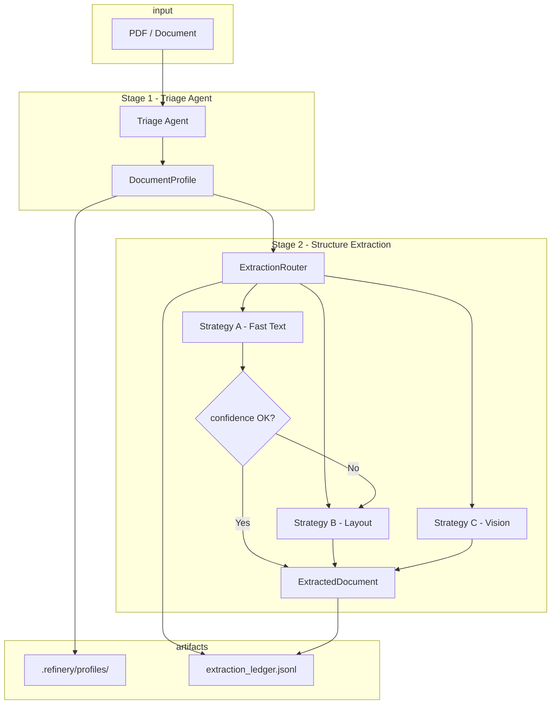
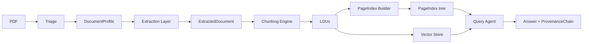

# Domain Notes — Document Science Primer (Phase 0)

## 1. Extraction Strategy Decision Tree

The Refinery selects an extraction strategy from the **DocumentProfile** produced by the Triage Agent. The decision tree is:

```
Document ingested
       │
       ▼
┌──────────────────┐
│ Triage Agent     │  → origin_type, layout_complexity, domain_hint
│ (pdfplumber      │  → estimated_extraction_cost
│  analysis)       │
└────────┬─────────┘
         │
         ▼
   ┌─────────────────────────────────────────────────────────┐
   │ estimated_extraction_cost ?                             │
   ├─────────────────────────────────────────────────────────┤
   │ NEEDS_VISION_MODEL  → Strategy C (Vision / VLM)          │
   │   • origin_type = scanned_image                          │
   │   • Handwriting, low/no character stream                 │
   ├─────────────────────────────────────────────────────────┤
   │ NEEDS_LAYOUT_MODEL  → Strategy B (Layout: Docling/       │
   │   pdfplumber layout)                                     │
   │   • multi_column, table_heavy, figure_heavy, mixed       │
   │   • origin_type = mixed                                  │
   ├─────────────────────────────────────────────────────────┤
   │ FAST_TEXT_SUFFICIENT → Strategy A (Fast Text)            │
   │   • origin_type = native_digital                         │
   │   • layout_complexity = single_column                    │
   │   • Then: confidence gate                                 │
   │     - confidence ≥ threshold → accept                    │
   │     - confidence < threshold → escalate to B, then C     │
   └─────────────────────────────────────────────────────────┘
```

**Escalation guard (mandatory):** After Strategy A runs, we compute a confidence score (character count, density, image ratio, font metadata). If confidence &lt; 0.6 (configurable in `extraction_rules.yaml`), we do **not** pass the result downstream; we retry with Strategy B. If B’s confidence is still low, we escalate to Strategy C. This prevents “garbage in, hallucination out” in RAG.

---

## 2. Failure Modes Observed Across Document Types

| Failure mode | Cause | Document types most affected | Mitigation in Refinery |
|--------------|--------|------------------------------|-------------------------|
| **Structure collapse** | OCR / flat text extraction flattens columns, breaks tables, drops headers | All; worst on multi-column and table-heavy | Strategy B (layout-aware) or C (vision); normalized `ExtractedDocument` with tables as structured JSON and text blocks with bbox. |
| **Context poverty** | Chunking severs tables, figure–caption links, section continuity | Table-heavy, technical, financial | Chunking constitution: table cells never split from header; figure caption as metadata; section header as parent metadata (Phase 3). |
| **Provenance blindness** | No page/bbox for extracted facts | All | Every fact/chunk carries `page_refs`, `bounding_box`, and `content_hash`; `ProvenanceChain` on every answer. |
| **Scanned-as-digital** | Heuristic wrongly classifies scanned PDF as native (e.g. embedded text layer from OCR) | Scanned gov/legal (Class B) | Triage uses character density + image area ratio + font metadata; low char count + high image area → scanned → Strategy C. |
| **Over-use of VLM** | Sending every doc to vision model | Cost/speed | Triage + escalation: use fast text when safe; only escalate to vision when confidence is low or origin is scanned. |
| **Table as plain text** | Tables extracted as run-on strings | Class A, C, D | Strategy B and pdfplumber `find_tables()`; output `ExtractedTable` with headers + rows + optional bbox. |

---

## 3. Pipeline Diagram (Mermaid)

High-level Refinery pipeline with strategy routing and escalation:



End-to-end (all five stages, for reference):



---

## 4. Thresholds and Justification

Defined in **rubric/extraction_rules.yaml** and used by the Fast Text strategy and router:

- **min_chars_per_page: 100** — Below this, the page likely has no meaningful text stream (e.g. image-only); contributes to low confidence and escalation.
- **max_image_area_ratio: 0.5** — If images cover more than half the page, we assume layout/vision may be needed; reduces confidence.
- **min_confidence_to_accept: 0.6** — Below this, we do not accept Strategy A output and escalate to B (then C if needed).

These values are conservative so that we prefer escalating to layout/vision over passing low-quality text into RAG.
