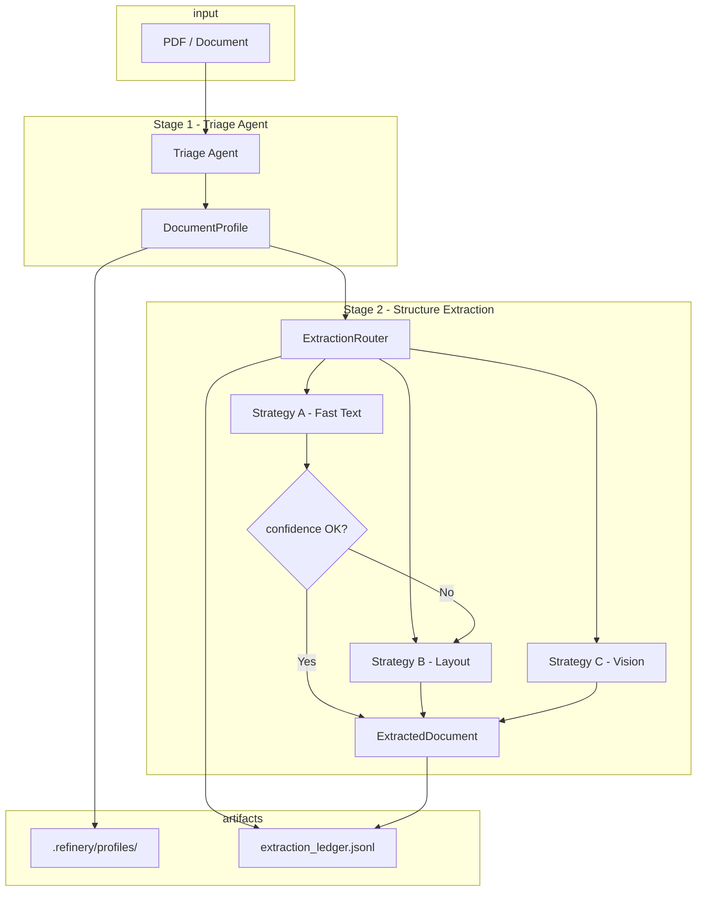
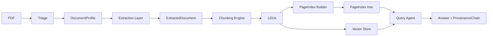

# Domain Notes — Document Science Primer (Phase 0)

## 1. Extraction Strategy Decision Tree

The Refinery selects an extraction strategy from the **DocumentProfile** produced by the Triage Agent. The decision tree is:

```
Document ingested
       │
       ▼
┌──────────────────┐
│ Triage Agent     │  → origin_type, layout_complexity, domain_hint
│ (pdfplumber      │  → estimated_extraction_cost
│  analysis)       │
└────────┬─────────┘
         │
         ▼
   ┌─────────────────────────────────────────────────────────┐
   │ estimated_extraction_cost ?                             │
   ├─────────────────────────────────────────────────────────┤
   │ NEEDS_VISION_MODEL  → Strategy C (Vision / VLM)          │
   │   • origin_type = scanned_image                          │
   │   • Handwriting, low/no character stream                 │
   ├─────────────────────────────────────────────────────────┤
   │ NEEDS_LAYOUT_MODEL  → Strategy B (Layout: Docling/       │
   │   pdfplumber layout)                                     │
   │   • multi_column, table_heavy, figure_heavy, mixed       │
   │   • origin_type = mixed                                  │
   ├─────────────────────────────────────────────────────────┤
   │ FAST_TEXT_SUFFICIENT → Strategy A (Fast Text)            │
   │   • origin_type = native_digital                         │
   │   • layout_complexity = single_column                    │
   │   • Then: confidence gate                                 │
   │     - confidence ≥ threshold → accept                    │
   │     - confidence < threshold → escalate to B, then C     │
   └─────────────────────────────────────────────────────────┘
```

**Escalation guard (mandatory):** After Strategy A runs, we compute a confidence score (character count, density, image ratio, font metadata). If confidence &lt; 0.6 (configurable in `extraction_rules.yaml`), we do **not** pass the result downstream; we retry with Strategy B. If B’s confidence is still low, we escalate to Strategy C. This prevents “garbage in, hallucination out” in RAG.

---

## 2. Failure Modes by Document Class (Corpus-Aligned)

**Why failures occur (technical):** PDF content is a display list (glyphs + positions); naive extraction uses stream order, not reading order, so columns and tables collapse. Chunking by token count splits logical units (tables, figure–caption pairs). Extractors that do not attach (page, bbox) leave no provenance. Scanned PDFs may have a weak OCR text layer, so triage can misclassify them as native. Thresholds for triage and escalation are loaded from **rubric/extraction_rules.yaml** (no hardcoding).

| Failure mode | Cause (technical) | Class A (Annual) | Class B (Scanned) | Class C (Technical) | Class D (Tax tables) | Mitigation |
|--------------|-------------------|------------------|-------------------|----------------------|----------------------|------------|
| **Structure collapse** | Stream-order extraction; no layout model → columns/tables flattened. | Multi-column + tables become run-on text. | N/A (no native stream). | Mixed layout; tables flattened. | Numeric tables lose alignment. | Strategy B/C; `ExtractedDocument` with tables as JSON and bbox. |
| **Context poverty** | Fixed-size chunking splits mid-table / mid-section. | Table rows split from headers. | Figures and captions split. | Section “Findings” split from list. | Multi-year table split. | Chunking rules: table+header; figure caption as metadata; section as parent (Phase 3). |
| **Provenance blindness** | No (page, bbox) attached to extracted text. | Figures not traceable to page. | Auditor refs need page attribution. | Findings must cite section/page. | Fiscal figures must cite source. | `page_refs`, `bbox`, `content_hash`; `ProvenanceChain`. |
| **Scanned-as-digital** | OCR text layer present but poor; triage sees chars and classifies as native. | Rare. | DBE Audit: possible if OCR layer exists. | Possible for scanned annexes. | Possible for appendices. | Triage: char density + image ratio from config → Strategy C. |
| **Over-use of VLM** | Using vision for every doc multiplies cost/latency. | CBE report fine with fast text. | Required (no stream). | Layout often enough. | Layout first, VLM on low confidence. | Triage + escalation; `review_required` when still low. |
| **Table as plain text** | `extract_text()` only; no table detection. | Income/balance sheet unparseable. | N/A. | Assessment tables unstructured. | Fiscal tables lose semantics. | Strategy B: `find_tables()`; `ExtractedTable` with headers + rows. |

---

## 3. Pipeline Diagram (Mermaid)

High-level Refinery pipeline with strategy routing and escalation:



End-to-end (all five stages, for reference):



---

## 4. Thresholds and Justification

All thresholds are **loaded from rubric/extraction_rules.yaml** via `src.config.load_config()` and used by the Triage Agent, Fast Text strategy, ExtractionRouter, and Vision strategy. No values are hardcoded; new document types can be onboarded by editing the YAML.

- **extraction.fast_text.min_chars_per_page** (default 100) — Below this, the page likely has no meaningful text stream (image-only); used for origin detection in triage and for confidence scoring in Fast Text; contributes to escalation.
- **extraction.fast_text.max_image_area_ratio** (default 0.5) — If images cover more than half the page, layout/vision may be needed; used in triage and confidence.
- **extraction.escalation.confidence_threshold** (default 0.6) — Below this, we do not accept Strategy A output and escalate to B (then C if needed). When final confidence remains below this after all strategies, the ledger entry is written with **review_required: true** for human review.

These values are conservative so that we prefer escalating to layout/vision over passing low-quality text into RAG.
