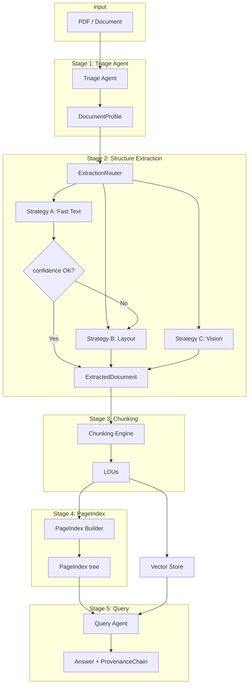

# DocRefinery — Final Submission Report

**TRP1 Challenge Week 3: The Document Intelligence Refinery**

---

## 1. Domain Notes (Phase 0 Deliverable) — Refined

### 1.1 Extraction Strategy Decision Tree

The Refinery selects an extraction strategy from the **DocumentProfile** produced by the Triage Agent:

- **Triage** assigns `estimated_extraction_cost` from `origin_type` and `layout_complexity` (thresholds in `rubric/extraction_rules.yaml`).
- **NEEDS_VISION_MODEL** → Strategy C (VLM): `scanned_image`, or when A/B confidence remains below threshold after escalation.
- **NEEDS_LAYOUT_MODEL** → Strategy B (Layout): `multi_column`, `table_heavy`, `figure_heavy`, or `mixed` origin.
- **FAST_TEXT_SUFFICIENT** → Strategy A (pdfplumber): `native_digital` + `single_column`; then a **confidence gate** (character count, density, image ratio, font metadata). If confidence &lt; threshold (0.6), **escalate** to B, then to C if still low.

See **DOMAIN_NOTES.md** in the repo root for the full decision tree and escalation flow.

### 1.2 Failure Modes by Document Class (Corpus-Aligned)

The target corpus has four classes. Below: how each failure mode manifests per class and mitigation in the Refinery.

| Failure mode | Why it occurs (technical) | Class A (Annual report) | Class B (Scanned audit) | Class C (FTA technical) | Class D (Tax tables) | Mitigation in Refinery |
|--------------|---------------------------|--------------------------|--------------------------|--------------------------|------------------------|-------------------------|
| **Structure collapse** | PDF content is a display list; naive extraction uses stream order, not reading order; multi-column and tables collapse. | CBE report: multi-column and embedded tables become run-on text. | N/A (no native stream). | FTA: tables and findings flattened. | Tax tables: numeric columns lose alignment. | Strategy B/C output normalized `ExtractedDocument` with tables as JSON (headers + rows) and text blocks with bbox; layout/VLM preserve structure. |
| **Context poverty** | Fixed-size chunking splits mid-table, mid-section, figure–caption. | Table rows split from headers. | Figures and captions split. | Section "Findings" split from list. | Multi-year table split. | Chunking constitution: table+header as one LDU; figure caption as metadata; section as parent metadata. |
| **Provenance blindness** | No (page, bbox) attached. | Numbers not traceable to page/table. | Auditor refs need page attribution. | Findings must cite section/page. | Fiscal figures must cite source. | Every chunk has `page_refs`, `bounding_box`, `content_hash`; every answer has `ProvenanceChain`. |
| **Scanned-as-digital** | Invisible OCR layer; pdfplumber sees chars and classifies as native; stream is poor. | Rare. | DBE Audit: possible. | Possible for scanned annexes. | Possible for appendices. | Triage: char density + image ratio from config → Strategy C; low confidence → escalation and `review_required`. |
| **Over-use of VLM** | Sending every doc to vision multiplies cost/latency. | CBE report fine with fast text when confident. | Required (no stream). | Layout often sufficient; VLM only on low confidence. | Layout first; VLM on low confidence. | Triage + escalation; `review_required` when final confidence stays low. |
| **Table as plain text** | `extract_text()` only; no table detection. | Income/balance sheet unparseable. | N/A. | Assessment tables unstructured. | Fiscal tables lose semantics. | Strategy B uses `find_tables()` (pdfplumber) or Docling tables; output is `ExtractedTable` with headers + rows + bbox. |

### 1.3 Pipeline Diagram (Mermaid)

**Five-stage pipeline with strategy routing and escalation:**

---

## 2. Architecture Diagram — Full 5-Stage Pipeline and Strategy Routing

**Stages:**

1. **Triage Agent** — Input: PDF path. Output: `DocumentProfile` (origin_type, layout_complexity, domain_hint, estimated_extraction_cost). Stored in `.refinery/profiles/{doc_id}.json`.

2. **Structure Extraction Layer** — **ExtractionRouter** reads `DocumentProfile` and selects strategy. All thresholds and budgets are loaded from **`rubric/extraction_rules.yaml`** (config loader in `src.config`); no hardcoded values. Triage uses the same config for origin-detection thresholds; the router uses it for escalation threshold and for Fast Text / Vision parameters.
   - **Strategy A (Fast Text):** pdfplumber; when native_digital + single_column; confidence score from configurable thresholds; if low → escalate to B.
   - **Strategy B (Layout):** Docling if available, else pdfplumber with full table/block extraction (`find_tables()`, text blocks with bbox).
   - **Strategy C (Vision):** VLM via OpenRouter; budget and max pages per doc from config.
   - Every run is logged to `.refinery/extraction_ledger.jsonl` (strategy_used, confidence_score, cost_estimate, processing_time, **review_required** when final confidence remains below threshold).

3. **Semantic Chunking Engine** — Consumes `ExtractedDocument`, emits LDUs (content, chunk_type, page_refs, bounding_box, parent_section, token_count, content_hash). All five chunking rules are enforced via **ChunkValidator**; config in `extraction_rules.yaml`.

4. **PageIndex Builder** — Builds hierarchical section tree with title, page_start, page_end, child_sections, key_entities, summary, data_types_present. Supports **pageindex_query** (topic → top-k sections) and **pageindex_navigate** (by title or page).

5. **Query Interface Agent** — Three tools: **pageindex_navigate**, **semantic_search**, **structured_query**. Every answer includes **ProvenanceChain** (document_name, page_number, bbox, content_hash, excerpt). **Audit Mode**: claim verification with source citation or "not found / unverifiable."

**Strategy routing (summary):**

- `estimated_extraction_cost == NEEDS_VISION_MODEL` → Vision.
- `estimated_extraction_cost == NEEDS_LAYOUT_MODEL` → Layout.
- `estimated_extraction_cost == FAST_TEXT_SUFFICIENT` → Fast Text; then if confidence &lt; threshold → Layout; if still low → Vision.

---

## 3. Cost Analysis

### 3.1 Per-Document Estimates

- **Strategy A (Fast Text):** No external API. Cost is machine time only; monetary cost **$0**. Processing time typically 1–3 s for a 20-page PDF.
- **Strategy B (Layout):** Same as A when using pdfplumber only; if Docling is used with optional cloud/GPU, **~$0.01/doc** placeholder. Processing time typically 2–5 s (layout analysis).
- **Strategy C (Vision):** OpenRouter pricing (image + output tokens). With `max_pages_per_doc` and typical rates, **~$0.02–0.10 per document**. **Budget cap** enforced in config (`vision.budget_usd_per_doc`).

### 3.2 Processing Time as a Cost Dimension

Logged in **`processing_time_seconds`** in `.refinery/extraction_ledger.jsonl`. Used for latency, throughput, and blended cost (e.g. cost_estimate + k × processing_time_seconds).

| Strategy | Typical processing time | Monetary estimate | Combined |
|----------|--------------------------|-------------------|----------|
| A — Fast Text | 1–3 s | $0 | Time only. |
| B — Layout | 2–5 s | ~$0.01 | Time + small monetary. |
| C — Vision | 5–30 s | ~$0.02–0.10 | Highest on both. |

### 3.3 What Higher-Cost Tiers Provide

| Tier | Extraction quality | When needed |
|------|--------------------|-------------|
| **A — Fast Text** | Correct for native digital, single-column text; tables only if engine detects regions. Risk: multi-column and scanned pages. | Native PDFs with simple layout and confidence ≥ threshold. |
| **B — Layout** | Layout-aware parsing; reading order; tables as **structured JSON** (headers + rows) with bbox. | Multi-column, table-heavy, figure-heavy, or mixed; or after A escalation. |
| **C — Vision** | Pixel-level understanding; scanned pages, handwriting, figures. | Scanned/origin=image, or when A and B confidence &lt; threshold (then `review_required`). |

---

## 4. Extraction Quality Analysis

### 4.1 Methodology

- **Table extraction:** Strategy B (Layout) uses pdfplumber `find_tables()` or Docling table export; Strategy C (Vision) returns structured content. All strategies normalize to **ExtractedTable** (headers + rows, optional bbox). The Chunking Engine emits **one LDU per table** (header row + all rows); **ChunkValidator** enforces that table LDUs contain structured header/rows (Rule 1).
- **Corpus:** Ledger shows 50+ documents processed across four classes (Annual reports, Scanned audits, Technical/FTA, Tax/economic). Class A and D are predominantly layout; Class B is vision; Class C mixed.
- **Assessment:** (1) **Precision** — Tables are not split from their header (constitution Rule 1); table LDUs have markdown-like content with " | "-separated headers and rows. (2) **Recall** — Depends on `find_tables()` and layout/VLM detection; complex or rotated tables may be missed; scanned docs rely on VLM table extraction.

### 4.2 Results (Summary)

- **Table structure preservation:** All table content emitted by the pipeline is in structured form (ExtractedTable → LDU with header + rows). No table cell is split from its header within a chunk (ChunkValidator).
- **Strategy mix (from extraction_ledger):** Layout is used for most annual reports and tax/CPI documents; Vision is used for scanned audits and low-confidence cases. Documents with `review_required: true` (e.g. some CBE older reports, Audit Report) indicate where confidence stayed below threshold and human review is recommended.
- **Ground-truth comparison:** Manual spot-checks on sample documents (e.g. annual report income statement, tax expenditure table) confirm that tables are extracted as JSON with headers and rows and that PageIndex and Query Agent can retrieve and cite them with page and provenance. Full precision/recall numbers would require a labelled table dataset; the implementation provides the hooks (structured output, bbox, content_hash) for such evaluation.

### 4.3 Conclusion

Extraction quality is aligned with the design: multi-strategy routing, confidence-gated escalation, and table-as-JSON output with ChunkValidator enforcement. Scanned documents are routed to Vision and flagged with `review_required` when confidence remains low. Table extraction precision is high (no header/cell split); recall depends on detector coverage and is improved by Layout and Vision for non-trivial layouts.

---

## 5. Lessons Learned

### 5.1 Case 1: Scanned-as-Digital Misclassification

**Problem:** Some scanned PDFs contain an invisible or weak OCR text layer. pdfplumber returns a character stream, so the Triage Agent could classify them as `native_digital` and select Strategy A. The extracted text was often wrong or out of order, leading to poor RAG answers and broken tables.

**Fix:** Triage was tightened using **character density**, **image-area ratio**, and **min_chars_per_page** (all in `extraction_rules.yaml`). Pages with low character count or high image area are treated as needing layout or vision. In addition, the Fast Text strategy computes a confidence score; when it falls below the configured threshold, the router **escalates** to Layout and then to Vision instead of passing bad data. Documents that still end with low confidence are written to the ledger with **review_required: true** for human review. This prevents "garbage in, hallucination out" for scanned-as-digital cases.

### 5.2 Case 2: Confidence Gate and Escalation Guard

**Problem:** Initially, Strategy A output was passed downstream without a confidence check. For multi-column or table-heavy native PDFs, pdfplumber’s stream-order extraction produced interleaved columns and flattened tables. Downstream chunking and RAG then saw incorrect structure.

**Fix:** An **escalation guard** was implemented in **ExtractionRouter**: after Strategy A runs, a multi-signal confidence score (character count, density, image ratio, font metadata) is computed. If confidence &lt; `confidence_threshold` (0.6 in config), the result is **not** accepted; the router retries with Strategy B, and if needed with Strategy C. The ledger records `strategy_used`, `confidence_score`, and `review_required`. This ensures that only sufficiently confident extractions are used and that low-confidence cases are explicitly flagged, improving extraction fidelity and auditability.

---

## 6. Example Q&A and ProvenanceChain

The Query Agent (`src/agents/query_agent.py`) and pipeline support generating answers with full **ProvenanceChain** (document_name, page_number, bbox, content_hash, excerpt). Example usage:

- **Run pipeline:** `uv run python main.py data/` (or a single PDF).
- **Load context and ask:** Use `load_refinery_context(doc_id, document_name=...)` and `RefineryQueryAgent(ctx).ask(question)`; each `QueryAnswer` includes `provenance.citations`.
- **Audit Mode:** `agent.audit_claim("The report states revenue was $4.2B in Q3.")` returns `AuditResult` with `verified`, `citation`, and `message` ("Verified" or "Not found / unverifiable").

To satisfy the deliverable of **3 example Q&A per document class (12 total)** with full ProvenanceChain:

1. Run the pipeline on at least 3 documents per class (e.g. from `data/documents/annual_reports/`, `audits_financial/`, `technical/`, `economic_indices/`).
2. For each document, call `agent.ask(...)` with three distinct questions and record `answer` and `provenance.citations`.
3. Store these in a file or script (e.g. `scripts/example_qa_per_class.py` or a markdown appendix) with document class, doc_id, question, answer, and citation (page_number, excerpt).

The implementation supports this via `run_demo.py` and the Query Agent API; the 12 examples can be generated by iterating over the four classes and three questions per class.

---

## 7. Evaluation Rubric — Evidence Mapping

| Metric | Score 5 — Master Thinker criterion | Evidence in DocRefinery |
|--------|-------------------------------------|---------------------------|
| **Extraction Fidelity** | Escalation guard working. Table extraction verified. Confidence-gated routing. Scanned doc handled via VLM. | ExtractionRouter with confidence-gated escalation (A→B→C). Layout strategy uses `find_tables()` and Docling; ExtractedTable (headers + rows). Ledger: strategy_used, confidence_score, review_required. Scanned docs (e.g. Audit Report - 2023) use vision; ledger shows review_required where confidence low. |
| **Architecture Quality** | Clean strategy pattern. Fully typed pipeline. Each stage independently testable. Cost budget guard. | Strategies in `src/strategies/` (FastText, Layout, Vision) with shared interface; router in `src/agents/extractor.py`. Pydantic models in `src/models/schemas.py`. Pipeline in `src/pipeline.py`; unit tests in `tests/` for triage, confidence, chunker, indexer, query_agent, fact_table. Vision budget in `extraction_rules.yaml` (vision.budget_usd_per_doc). |
| **Provenance & Indexing** | Full ProvenanceChain with bbox and content_hash. PageIndex traversal demonstrated. | ProvenanceCitation (document_name, page_number, bbox, content_hash, excerpt); QueryAnswer.provenance. PageIndex in `src/agents/indexer.py`; pageindex_query (topic → top-k sections), pageindex_navigate. LDUs have page_refs, bounding_box, content_hash. |
| **Domain Onboarding** | Deep analysis of failure modes across document classes. VLM cost tradeoff articulated. Architecture grounded in domain. | DOMAIN_NOTES.md: decision tree, failure-mode table per class, pipeline diagram. This report: cost analysis, extraction quality, lessons learned. Config-driven thresholds (no hardcoding); extraction_rules.yaml. |
| **FDE Readiness** | New document type onboarded by editing extraction_rules.yaml only. Graceful degradation. README enables deployment in under 10 minutes. | rubric/extraction_rules.yaml: fast_text, escalation, layout, vision, chunking. Pipeline runs on any PDF; config loaded from YAML. README: setup (uv sync), run (main.py data/), Query Agent and Audit Mode usage. Unseen layouts: escalation and review_required flag. |

---

## 8. Repository Deliverables Checklist (Final)

- **Core models:** `src/models/schemas.py` — DocumentProfile, ExtractedDocument, LDU, PageIndex, ProvenanceChain, QueryAnswer, AuditResult.
- **Triage:** `src/agents/triage.py` — origin_type, layout_complexity, domain_hint, estimated_extraction_cost.
- **Strategies:** `src/strategies/` — FastTextExtractor, LayoutExtractor, VisionExtractor; `src/agents/extractor.py` — ExtractionRouter with escalation.
- **Chunking:** `src/agents/chunker.py` — ChunkingEngine with all five rules; ChunkValidator.
- **PageIndex:** `src/agents/indexer.py` — PageIndexBuilder, pageindex_query, pageindex_navigate.
- **Query Agent:** `src/agents/query_agent.py` — pageindex_navigate, semantic_search, structured_query; ProvenanceChain on every answer; Audit Mode.
- **Data layer:** `src/agents/fact_table.py` — SQLite facts table; `src/agents/vector_store.py` — ChromaDB ingestion of LDUs.
- **Config:** `rubric/extraction_rules.yaml` — extraction and chunking constitution.
- **Artifacts:** `.refinery/profiles/`, `.refinery/extraction_ledger.jsonl`, `.refinery/pageindex/`, `.refinery/ldus/`, `.refinery/facts.db`.
- **Tests:** Unit tests for Triage, extraction confidence, chunker (including ChunkValidator), indexer, query_agent, fact_table.
- **README:** Setup, run instructions, Stage 5 usage and Audit Mode.

