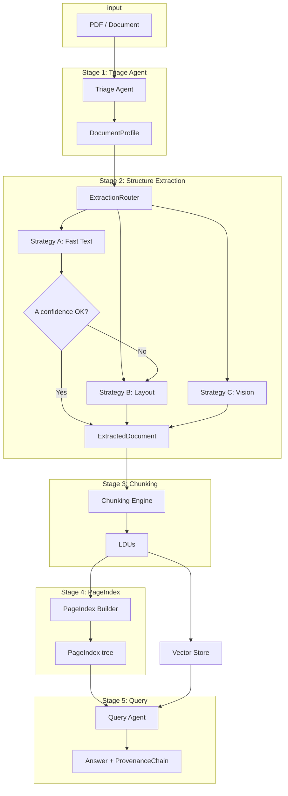

# DocRefinery — Interim Submission Report

---

## 1. Domain Notes (Phase 0 Deliverable)

### 1.1 Extraction Strategy Decision Tree

- **Triage** assigns `estimated_extraction_cost` from `origin_type` and `layout_complexity`.
- **NEEDS_VISION_MODEL** → Strategy C (VLM): scanned_image, or when A/B confidence is low after escalation.
- **NEEDS_LAYOUT_MODEL** → Strategy B (Layout): multi_column, table_heavy, figure_heavy, mixed origin.
- **FAST_TEXT_SUFFICIENT** → Strategy A (pdfplumber): native_digital + single_column; then a **confidence gate** (e.g. character count, density, image ratio, font metadata). If confidence &lt; threshold (0.6), **escalate** to B, then to C if still low.

See **DOMAIN_NOTES.md** in the repo root for the full decision tree and escalation flow.

### 1.2 Failure Modes Observed Across Document Types

| Failure mode | Mitigation in Refinery |
|--------------|------------------------|
| Structure collapse (tables/columns flattened) | Strategy B/C; normalized `ExtractedDocument` with tables as JSON and text blocks with bbox. |
| Context poverty (chunks sever tables/figures) | Chunking rules: table header with cells, figure caption as metadata, section as parent (Phase 3). |
| Provenance blindness | Every chunk/answer has `page_refs`, `bounding_box`, `content_hash`; `ProvenanceChain` on answers. |
| Scanned misclassified as digital | Triage: char density, image area ratio, font metadata → scanned → Strategy C. |
| Over-use of VLM | Triage + escalation: use fast text when safe; VLM only when necessary. |

### 1.3 Pipeline Diagram (Mermaid)

**Five-stage pipeline with strategy routing and escalation:**

---

## 2. Architecture Diagram — Full 5-Stage Pipeline and Strategy Routing

**Stages:**

1. **Triage Agent** — Input: PDF path. Output: `DocumentProfile` (origin_type, layout_complexity, domain_hint, estimated_extraction_cost). Stored in `.refinery/profiles/{doc_id}.json`.

2. **Structure Extraction Layer** — **ExtractionRouter** reads `DocumentProfile` and selects strategy:
   - **Strategy A (Fast Text):** pdfplumber; when native_digital + single_column; confidence score; if low → escalate to B.
   - **Strategy B (Layout):** Docling if available, else pdfplumber with full table/block extraction.
   - **Strategy C (Vision):** VLM via OpenRouter; budget cap per document.
   - Every run is logged to `.refinery/extraction_ledger.jsonl` (strategy_used, confidence_score, cost_estimate, processing_time).

3. **Semantic Chunking Engine** — Consumes `ExtractedDocument`, emits LDUs (content, chunk_type, page_refs, bounding_box, parent_section, token_count, content_hash). Chunking rules in `extraction_rules.yaml` (Phase 3 implementation).

4. **PageIndex Builder** — Builds hierarchical section tree with title, page_start, page_end, child_sections, key_entities, summary, data_types_present (Phase 3).

5. **Query Interface Agent** — Tools: pageindex_navigate, semantic_search, structured_query; every answer includes ProvenanceChain (Phase 3).

**Strategy routing logic (summary):**

- `estimated_extraction_cost == NEEDS_VISION_MODEL` → Vision.
- `estimated_extraction_cost == NEEDS_LAYOUT_MODEL` → Layout.
- `estimated_extraction_cost == FAST_TEXT_SUFFICIENT` → Fast Text; then if confidence &lt; threshold → Layout; if still low → Vision.

---

## 3. Cost Analysis

Estimated **cost per document** by strategy tier (order-of-magnitude; actual $ depend on provider and usage):

| Strategy | Tier | Typical trigger | Estimated cost per document | Notes |
|----------|------|------------------|------------------------------|--------|
| **A — Fast Text** | Low | native_digital + single_column, confidence ≥ threshold | **~$0** | Local pdfplumber; no API. |
| **B — Layout** | Medium | multi_column, table_heavy, figure_heavy, mixed; or post-escalation from A | **~$0.01** | Local Docling/pdfplumber; optional cloud only if Docling calls external services. |
| **C — Vision** | High | scanned_image; or A/B confidence &lt; threshold | **~$0.02–0.10** | VLM (e.g. GPT-4o-mini / Gemini Flash) via OpenRouter; depends on page count and image size. Budget cap per doc (e.g. $0.50) in `extraction_rules.yaml`. |

**Per-document cost estimate (blended):**

- If most docs are native and simple: **~$0** (Strategy A).
- If many are layout-heavy: **~$0.01** (Strategy B).
- If many are scanned or low-confidence: **~$0.05–0.10** (Strategy C).

The pipeline minimizes cost by using Fast Text when safe and escalating only when confidence is low or origin is scanned.

---
