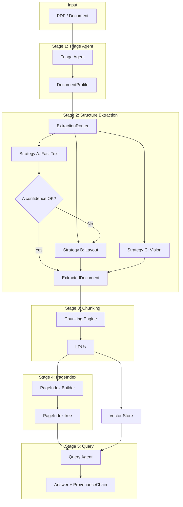

# DocRefinery — Interim Submission Report

---

## 1. Domain Notes (Phase 0 Deliverable)

### 1.1 Extraction Strategy Decision Tree

- **Triage** assigns `estimated_extraction_cost` from `origin_type` and `layout_complexity`.
- **NEEDS_VISION_MODEL** → Strategy C (VLM): scanned_image, or when A/B confidence is low after escalation.
- **NEEDS_LAYOUT_MODEL** → Strategy B (Layout): multi_column, table_heavy, figure_heavy, mixed origin.
- **FAST_TEXT_SUFFICIENT** → Strategy A (pdfplumber): native_digital + single_column; then a **confidence gate** (e.g. character count, density, image ratio, font metadata). If confidence &lt; threshold (0.6), **escalate** to B, then to C if still low.

See **DOMAIN_NOTES.md** in the repo root for the full decision tree and escalation flow.

### 1.2 Failure Modes by Document Class (Corpus-Aligned)

The target corpus has four classes. Below: how each failure mode manifests per class and why it occurs technically.

| Failure mode | Why it occurs (technical) | Class A (Annual report) | Class B (Scanned audit) | Class C (FTA technical) | Class D (Tax tables) | Mitigation in Refinery |
|--------------|---------------------------|--------------------------|--------------------------|--------------------------|------------------------|-------------------------|
| **Structure collapse** | PDF content is stored as a display list (glyphs + positions). Naive extraction emits characters in stream order, not reading order; multi-column text is interleaved and table cells lose row/column association. | CBE report: multi-column body and embedded tables (income statement, balance sheet) become run-on text; footnotes merge with body. | N/A (no native stream). | FTA report: assessment findings and tables in mixed layout get flattened; “see Table X” loses referent. | Tax expenditure tables: numeric columns align by layout; stream order breaks alignment and category hierarchy. | Strategy B/C output normalized `ExtractedDocument` with tables as JSON (headers + rows) and text blocks with bbox; layout/VLM preserve structure. |
| **Context poverty** | Fixed-size or token-count chunking splits at arbitrary byte boundaries. Table rows, list items, and figure–caption pairs are single logical units; splitting mid-unit breaks coherence and causes hallucination on retrieval. | Tables span chunk boundaries; “Total assets” separated from the number. | OCR output chunked without table detection; figures and captions split. | Section “3.2 Findings” split from the findings list; RAG returns incomplete answers. | Multi-year table (e.g. FY 2018–2021) split across chunks; year–value pairs broken. | Chunking constitution: table cells never split from header; figure caption as metadata; section as parent metadata (Phase 3). |
| **Provenance blindness** | Extractors that return only text do not attach (page, bbox). Downstream RAG cannot cite “page 47, table 2” for audit. | Numbers (e.g. revenue) cannot be traced to a specific page/table. | Scanned pages need page-level attribution for auditor references. | Findings and recommendations must be traceable to section and page. | Fiscal figures must be verifiable to source table and page. | Every chunk/answer has `page_refs`, `bounding_box`, `content_hash`; `ProvenanceChain` on answers. |
| **Scanned-as-digital** | Some scanned PDFs have an invisible OCR text layer; pdfplumber sees a character stream and classifies as native. The stream is often low quality (wrong words, no layout), so fast-text extraction is unreliable. | Rare (annual reports are usually born-digital). | DBE Audit Report: if OCR layer exists, triage may wrongly choose fast text; layout is still image-based. | Possible for scanned annexes. | Possible for scanned appendices. | Triage uses char density, image area ratio, and font metadata (all from config); low char count + high image area → scanned → Strategy C. |
| **Over-use of VLM** | Sending every document to a vision API multiplies cost and latency; native digital docs are handled correctly by fast text. | Would pay VLM for CBE report when pdfplumber suffices. | Required for Class B (no stream). | Often layout strategy suffices; VLM only if confidence stays low. | Table-heavy; layout strategy first; VLM only on low confidence. | Triage + escalation: fast text when safe; escalate only when confidence &lt; threshold or origin is scanned. |
| **Table as plain text** | pdfplumber’s `extract_text()` returns a single string per page; table regions are not detected. `find_tables()` is needed for structure; without it, tables become lines of text. | Income statement and balance sheet become unparseable text. | N/A (OCR text only). | Assessment tables and metrics become unstructured. | Fiscal tables (e.g. tax expenditure by year) lose column semantics. | Strategy B uses `find_tables()` and layout tools; output is `ExtractedTable` with headers + rows + optional bbox. |

### 1.3 Pipeline Diagram (Mermaid)

**Five-stage pipeline with strategy routing and escalation:**

---

## 2. Architecture Diagram — Full 5-Stage Pipeline and Strategy Routing

**Stages:**

1. **Triage Agent** — Input: PDF path. Output: `DocumentProfile` (origin_type, layout_complexity, domain_hint, estimated_extraction_cost). Stored in `.refinery/profiles/{doc_id}.json`.

2. **Structure Extraction Layer** — **ExtractionRouter** reads `DocumentProfile` and selects strategy. **All thresholds and budgets are loaded from `rubric/extraction_rules.yaml`** (config loader in `src.config`); no hardcoded values. Triage uses the same config for origin-detection thresholds; the router uses it for escalation threshold and for Fast Text / Vision parameters.
   - **Strategy A (Fast Text):** pdfplumber; when native_digital + single_column; confidence score from configurable thresholds; if low → escalate to B.
   - **Strategy B (Layout):** Docling if available, else pdfplumber with full table/block extraction.
   - **Strategy C (Vision):** VLM via OpenRouter; budget and max pages per doc from config.
   - Every run is logged to `.refinery/extraction_ledger.jsonl` (strategy_used, confidence_score, cost_estimate, processing_time, **review_required** when final confidence remains below threshold).

3. **Semantic Chunking Engine** — Consumes `ExtractedDocument`, emits LDUs (content, chunk_type, page_refs, bounding_box, parent_section, token_count, content_hash). Chunking rules in `extraction_rules.yaml` (Phase 3 implementation).

4. **PageIndex Builder** — Builds hierarchical section tree with title, page_start, page_end, child_sections, key_entities, summary, data_types_present (Phase 3).

5. **Query Interface Agent** — Tools: pageindex_navigate, semantic_search, structured_query; every answer includes ProvenanceChain (Phase 3).

**Strategy routing logic (summary):**

- `estimated_extraction_cost == NEEDS_VISION_MODEL` → Vision.
- `estimated_extraction_cost == NEEDS_LAYOUT_MODEL` → Layout.
- `estimated_extraction_cost == FAST_TEXT_SUFFICIENT` → Fast Text; then if confidence &lt; threshold → Layout; if still low → Vision.

---

## 3. Cost Analysis

### 3.1 Derivation of Per-Document Estimates

- **Strategy A (Fast Text):** No external API. Cost is **machine time only**: CPU for pdfplumber (open PDF, iterate pages, extract text/tables). For a 20-page PDF this is typically **&lt; 2 s** on a modest laptop. We treat monetary cost as **$0** and record **processing_time_seconds** in the extraction ledger.
- **Strategy B (Layout):** Same as A if using only pdfplumber with full table extraction. If Docling (or similar) is used with optional cloud/GPU, we assume a small marginal cost; **~$0.01/doc** is a placeholder for “local-plus-optional-service.” Processing time is typically **2–5 s** (layout analysis adds work).
- **Strategy C (Vision):** OpenRouter pricing for GPT-4o-mini–class vision (input image tokens + output tokens). **Assumptions:** ~1–2 pages sent per doc on average (cap via `max_pages_per_doc` in config), ~500–1500 image tokens per page, ~500–2000 output tokens. At typical listed rates (e.g. ~$0.0001–0.0003 per 1K image tokens, ~$0.0002 per 1K output tokens), **~$0.02–0.10 per document** is a plausible range. **Budget cap** (e.g. $0.50/doc) is enforced in `extraction_rules.yaml` (`vision.budget_usd_per_doc`).

### 3.2 Processing Time as a Cost Dimension

Processing time is logged for every extraction in **`processing_time_seconds`** in `.refinery/extraction_ledger.jsonl`. It acts as a cost dimension because:

- **Latency:** Higher tiers (layout, vision) take longer; batch or real-time SLAs depend on it.
- **Throughput:** For a fixed worker pool, more seconds per doc means fewer docs per hour.
- **Blended “cost”:** A simple metric such as `cost_estimate + k * processing_time_seconds` (with k in $/second) can combine monetary and time cost for capacity planning.

| Strategy | Typical processing time (single doc) | Monetary estimate | Combined (time + money) |
|----------|--------------------------------------|-------------------|--------------------------|
| A — Fast Text | 1–3 s | $0 | Dominated by time. |
| B — Layout | 2–5 s | ~$0.01 | Time + small monetary. |
| C — Vision | 5–30 s (API call + pages) | ~$0.02–0.10 | Highest on both dimensions. |

### 3.3 What Higher-Cost Tiers Provide (Extraction Quality)

| Tier | Extraction quality and guarantees | When it is needed |
|------|------------------------------------|--------------------|
| **A — Fast Text** | Correct for **native digital, single-column** text. Tables are extracted only if the engine detects table regions (e.g. pdfplumber `find_tables()`). **Risk:** Multi-column and complex layouts produce wrong reading order and merged text; scanned or image-heavy pages have no or poor character stream. | Native PDFs with simple layout and high confidence (configurable threshold). |
| **B — Layout** | **Layout-aware** parsing: reading order, multi-column, and table structure are explicitly handled (Docling or enhanced pdfplumber). Tables are output as **structured JSON** (headers + rows) with optional bbox. **Better:** Preserves table semantics and section structure; **still limited** on pure image content (no pixels interpreted). | Multi-column, table-heavy, figure-heavy, or mixed-origin docs; or when A’s confidence is below threshold. |
| **C — Vision** | **Pixel-level** understanding: the model “sees” the page image. Handles **scanned pages**, handwriting, figures, and complex layouts without relying on a text layer. **Best** for extraction quality when no reliable character stream exists; **cost:** highest monetary and processing time. | Scanned/origin=image, or when A and B both report confidence below threshold (output is then flagged with `review_required` in the ledger). |

The pipeline minimizes cost by using the lowest tier that meets the confidence bar; escalation and `review_required` ensure low-confidence extractions are explicitly flagged for human review.

---
